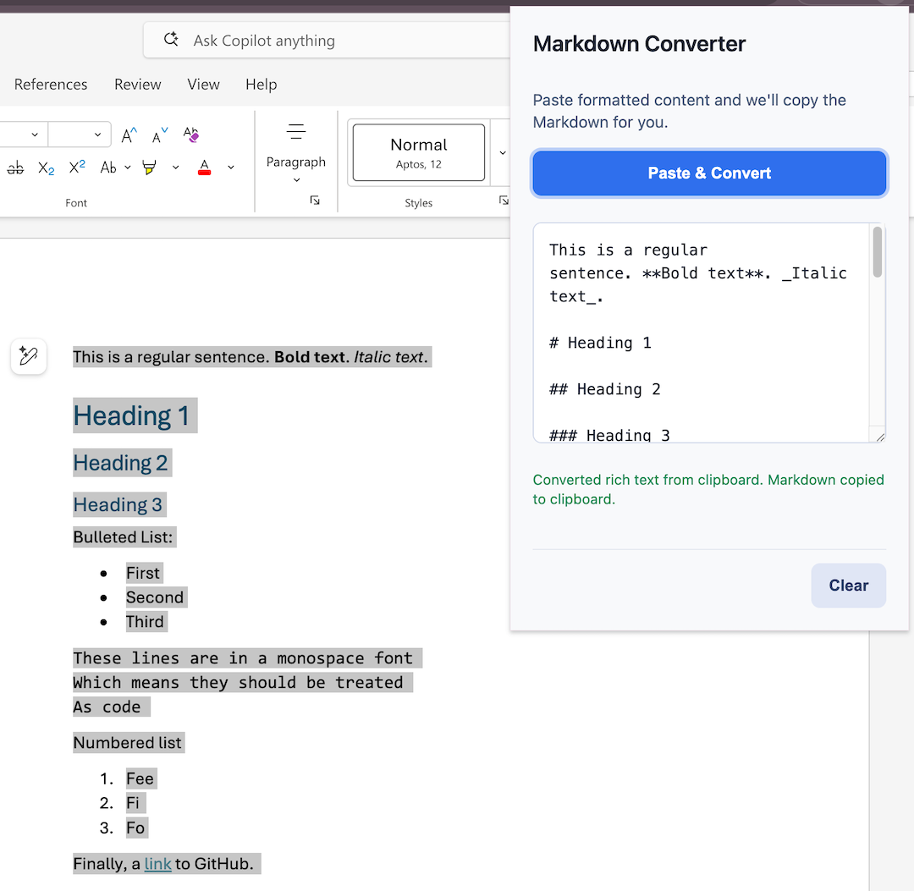
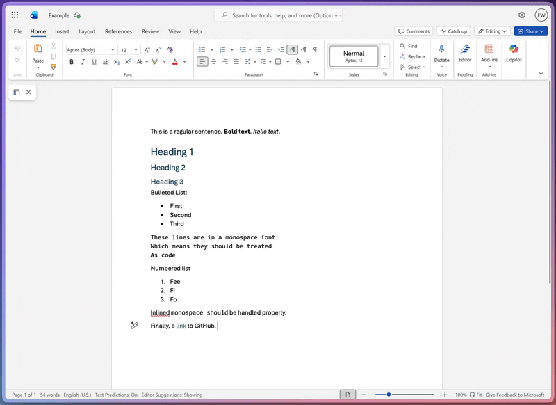

# Markdown Clipboard Converter

A multi-platform clipboard converter that transforms rich text into polished Markdown. Available as a Chrome/Edge/Firefox browser extension, with Raycast integration in development.

**Primary Platform: Browser Extension** – Paste formatted content from Microsoft Word, Google Docs, or the web, preview the converted Markdown instantly, and copy it back to your clipboard in a single click.

## Install

- **Google Chrome** – [Markdown Converter for the web, Word, and Google Docs](https://chromewebstore.google.com/detail/markdown-converter-for-th/bnfjgeonjiooklgimcmobnkeibiiaamp)
- **Microsoft Edge** – [Markdown Converter for the web, Word, and Google Docs](https://microsoftedge.microsoft.com/addons/detail/markdown-converter-for-th/jhgdmdnfelimaoponohkkimlfbgnadam)
- **Firefox or Zen** – [Markdown Converter](https://addons.mozilla.org/en-US/firefox/addon/markdown-converter/)

### Raycast extension

There is already a well-featured Raycast Markdown converter, [Paste to Markdown](https://www.raycast.com/weicodes/paste-to-markdown). Until my integration is approved by Raycast, please use theirs. We've agreed there's likely enough room for two in the Raycast store as we're taking different approaches. You can install mine locally as a Raycast developer using `npm run dev:raycast`.

## Features

- **One-click conversion** – Read HTML from the clipboard and convert it to Markdown using [Turndown](https://github.com/mixmark-io/turndown).
- **Context menu integration** – Right-click on selected text anywhere on the web and choose "Copy as Markdown" to convert and copy formatted content instantly.
- **Smart fallback** – Gracefully handles plain text when no rich content is available.
- **Automatic copy-back** – Immediately writes the generated Markdown to your clipboard after each conversion.
- **Live paste listener** – Supports keyboard pastes (`Cmd/Ctrl + V`) directly inside the popup.
- **Word-aware headings** – Promotes Microsoft Word clipboard headings so Markdown keeps its structure.
- **Google Docs normalization** – Cleans up Docs-specific spans and non-breaking spaces so the output stays readable.
- **Monospace heuristics** – Detects Courier-style Word paragraphs and emits fenced code blocks.
- **Bold span detection** – Upgrades inline `font-weight: bold` spans into Markdown `**strong**` text.
- **Image support** – Includes conversion of inline images (beware large images will result in massive Markdown!)

## Screenshot

## Usage

### Method 1: Extension Popup
1. Click the extension icon to open the popup.
2. Press **Paste & Convert** or press `Cmd/Ctrl + V` with formatted content on your clipboard.
3. The Markdown appears in the output area and is automatically copied back to your clipboard so you can paste it wherever it's needed.

### Method 2: Context Menu (New!)
1. Select any formatted text on a webpage, document, or local HTML file.
2. Right-click on the selection and choose **"Copy as Markdown"** from the context menu.
3. The converted Markdown is automatically copied to your clipboard – no popup needed!
4. A green checkmark (✓) badge appears on the extension icon to confirm successful conversion.

> **Clipboard permissions**: Chrome will prompt for clipboard permissions when first reading or writing. Accept the prompt so the extension can function correctly.

### Raycast Extension (pending review by Raycast)

A native Raycast command for clipboard conversion, on macOS only:

1. Copy formatted content from any application (Word, Google Docs, web pages, etc.)
2. Open Raycast and run "Convert Clipboard to Markdown"
3. Converted Markdown is automatically copied back to your clipboard

## For org users

If you use [org-mode](https://orgmode.org/), mdconv has built-in Org output support:

- **Browser extension**: Select "Org" from the format dropdown, or use the "Copy as Org" context menu
- **Keyboard shortcut**: Cmd+Shift+O (Mac) / Ctrl+Shift+O (Windows/Linux)
- **Raycast**: Use the "Convert Clipboard to Org" command

## For Developers

See [DEVELOPERS.md](DEVELOPERS.md) for:
- Architecture overview and platform design
- Build instructions for Chrome, Firefox, and Raycast
- Development workflow and testing
- Code quality standards

## Credits

* @nahals for original inspiration, Windows usage, and more
* This extension builds on the amazing [Turndown](https://github.com/mixmark-io/turndown) library

## License

