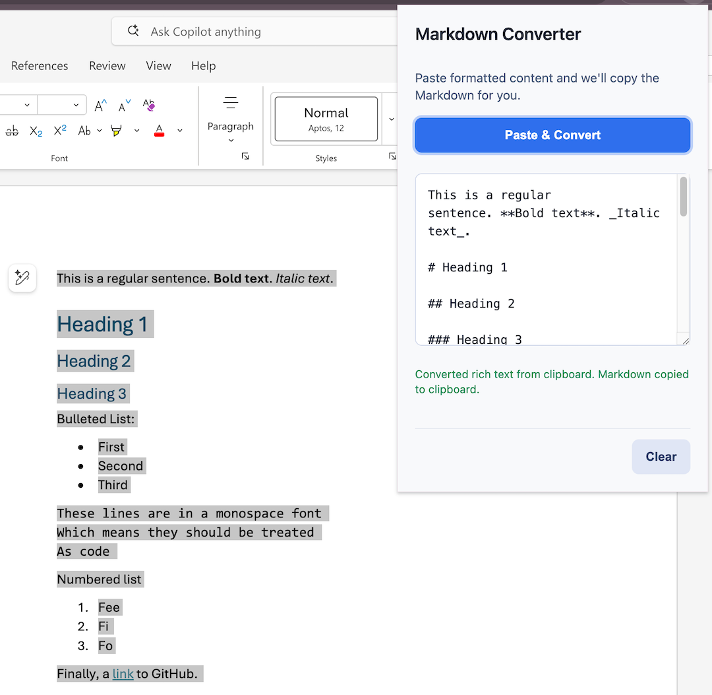

# Markdown Clipboard Converter

A Chrome/Edge extension that transforms rich text from your clipboard into polished Markdown. Paste formatted content, preview the converted Markdown instantly, and copy it back to your clipboard in a single click.

Created with a lot of help from Copilot in VS Code, using GPT-5-Codex and Sonnet 4 models. 

## Features

- **One-click conversion** – Read HTML from the clipboard and convert it to Markdown using [Turndown](https://github.com/mixmark-io/turndown).
- **Smart fallback** – Gracefully handles plain text when no rich content is available.
- **Automatic copy-back** – Immediately writes the generated Markdown to your clipboard after each conversion.
- **Live paste listener** – Supports keyboard pastes (`Cmd/Ctrl + V`) directly inside the popup.
- **Word-aware headings** – Promotes Microsoft Word clipboard headings so Markdown keeps its structure.
- **Monospace heuristics** – Detects Courier-style Word paragraphs and emits fenced code blocks.
- **Bold span detection** – Upgrades inline `font-weight: bold` spans into Markdown `**strong**` text.
- **🎨 Image handling** – Preserves images from clipboard content, supporting external URLs, base64 data URLs, and standalone clipboard images.

## Screenshot




## Getting Started

### 1. Install Node.js (Mac)

Install Node, preferable through [Homebrew](https://brew.sh/).

### 1. Install Node.js (Windows users)

If you don't have Node.js installed on Windows:

1. Visit [nodejs.org](https://nodejs.org) and download the LTS version (recommended)
2. Run the installer and follow the installation wizard
3. Restart your terminal/VS Code after installation
4. Verify installation by running: `node --version` and `npm --version`

**PowerShell Execution Policy Fix:**
If you encounter "cannot be loaded because running scripts is disabled" error when using npm:
```powershell
Set-ExecutionPolicy -ExecutionPolicy RemoteSigned -Scope CurrentUser
```

### 2. Install dependencies

```bash
npm install
```

### 3. Build the extension

```bash
npm run build
```

The compiled assets are emitted to `dist/`.

### 4. Load the unpacked extension in Chrome

1. Open `chrome://extensions` in your browser.
2. Toggle **Developer mode** on (top-right switch).
3. Click **Load unpacked** and choose the `dist` folder.
4. The “Markdown Clipboard Converter” icon will appear in the toolbar.

### 5. Load the unpacked extension in Chrome or Edge

**For Chrome:**
1. Open `chrome://extensions` in your browser.
2. Toggle **Developer mode** on (top-right switch).
3. Click **Load unpacked** and choose the `dist` folder.
4. The "Markdown Clipboard Converter" icon will appear in the toolbar.

**For Microsoft Edge:**
1. Open `edge://extensions/` in your browser.
2. Toggle **Developer mode** on (left sidebar).
3. Click **Load unpacked** and choose the `dist` folder.
4. The "Markdown Clipboard Converter" icon will appear in the toolbar.

**To pin the extension for easy access:**
- Click the puzzle piece icon (🧩) in the toolbar, then click the pin icon next to "Markdown Clipboard Converter"
- **Edge**: Click the puzzle piece icon (🧩) in the toolbar, then click the pin icon next to "Markdown Clipboard Converter"

### 6. (Optional) Start a development watch task

```bash
npm run dev
```

This runs esbuild in watch mode and mirrors static assets into `dist/` whenever they change.

### 7. (Optional) Type-check only

```bash
npm run typecheck
```

Runs TypeScript diagnostics without emitting bundled assets.

## Usage

1. Click the extension icon to open the popup.
2. Press **Paste & Convert** or press `Cmd/Ctrl + V` with formatted content on your clipboard.
3. The Markdown appears in the output area and is automatically copied back to your clipboard so you can paste it wherever it's needed.

> **Clipboard permissions**: Chrome will prompt for clipboard permissions when first reading or writing. Accept the prompt so the extension can function correctly.

## Image Handling

The extension now supports images in clipboard content:

- **External images** – Images with HTTP/HTTPS URLs are converted to standard Markdown syntax: ``
- **Base64 images** – Data URL images are preserved in Markdown (useful for inline images from Google Docs, Word, etc.)
- **Clipboard images** – Images copied directly to clipboard (e.g., from screenshots) are automatically embedded as data URLs
- **Missing images** – Images without sources get placeholder text: ``

**Size limits**: Data URL images larger than 1MB are replaced with placeholders to prevent performance issues.

**Supported sources**: Google Docs, Microsoft Word, web pages, screenshot tools, and other applications that put images on the clipboard.

## Project Structure

```
static/           # Manifest, popup HTML/CSS, placeholder icons
src/              # TypeScript source (popup logic, background service worker)
dist/             # Build output (generated)
PRD.md            # Product requirements document
```


## License

MIT
